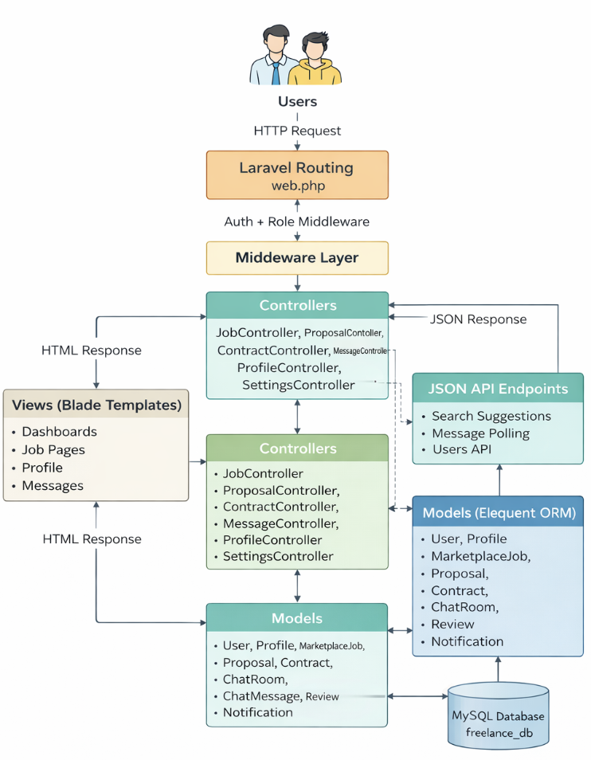

# Freelance Job Marketplace System

A web-based Freelance Job Marketplace built with **Laravel** and **MySQL**, designed to connect **clients** and **freelancers** through a secure, role-based platform.  
The system allows clients to post jobs, freelancers to submit proposals, and both parties to collaborate through contracts, messaging, and reviews.

---

## 📌 Project Overview

The Freelance Job Marketplace System is a full-stack web application developed as an academic and practical project.  
It demonstrates the use of **MVC architecture**, **relational database design**, and **secure web application practices** in a real-world freelancing scenario.

### Key Objectives
- Provide a structured job marketplace for clients and freelancers
- Demonstrate Laravel MVC architecture and Eloquent ORM
- Implement role-based access control
- Support real-world freelancing workflows (job posting → proposal → contract → review)

---

## 🛠️ Technology Stack

| Layer | Technology |
|-----|-----------|
| Backend | Laravel (PHP) |
| Frontend | HTML, CSS, JavaScript, Blade |
| Database | MySQL |
| Authentication | Laravel Auth / Breeze |
| Architecture | MVC |
| API | RESTful |
| Security | Middleware, CSRF, Validation |

---

## 👥 User Roles

### Client
- Post, edit, and delete jobs
- View freelancer proposals
- Accept or reject proposals
- Create and manage contracts
- Communicate with freelancers
- Review completed work

### Freelancer
- Browse and search jobs
- Apply for jobs (submit proposals)
- Save jobs for later
- Manage active contracts
- Communicate with clients
- Maintain profile and portfolio

---

## ✨ Core Features

- User authentication and role-based access
- Job marketplace with search and categories
- Proposal submission and management
- Contract and milestone tracking
- Real-time-style messaging system
- Saved jobs functionality
- Reviews and ratings
- Notification system
- Profile and settings management

---

## 🧱 System Architecture

The system follows the **Model–View–Controller (MVC)** pattern:

- **Models:** Handle data and database relationships (Eloquent ORM)
- **Views:** Blade templates for UI rendering
- **Controllers:** Process requests, apply business logic, and return responses

This architecture ensures scalability, maintainability, and clean separation of concerns.

---

## 🗄️ Database Design

- Relational database (`freelance_db`)
- Normalized schema
- Primary and foreign keys for integrity
- Core tables include:
  - users, profiles
  - marketplace_jobs, categories, saved_jobs
  - proposals, contracts, milestones, disputes
  - chat_rooms, chat_messages, notifications
  - reviews, payment_methods

---

## 🗄️ Flowchart



## 🚀 Installation & Setup

### Prerequisites
- PHP 8.0+
- Composer
- MySQL
- Node.js & npm
- Laravel CLI
- Apache / XAMPP / Laragon

### Setup Steps

```bash
# Clone the repository
git clone https://github.com/tasnia2/freelance-job-marketplace.git

# Navigate to project directory
cd freelance-job-marketplace

# Install backend dependencies
composer install

# Install frontend dependencies
npm install

# Create environment file
cp .env.example .env

# Generate application key
php artisan key:generate
Configure Database (.env)
DB_DATABASE=freelance_db
DB_USERNAME=root
DB_PASSWORD=

Run Migrations
php artisan migrate

Start Development Server
php artisan serve


Access the application at:

http://127.0.0.1:8000

🔐 Security Features

Password hashing

CSRF protection

Role-based middleware (client, freelancer)

Input validation

Secure session handling


📈 Future Enhancements

Online payment gateway integration

Admin moderation panel

Real-time chat using WebSockets

Recommendation system for jobs

Mobile application support

📚 Documentation

Detailed documentation is available in the project report, including:

Technical Documentation

ERD, Class, and Sequence Diagrams

User Guide and FAQs

Architecture Diagrams

🎓 Academic Context

This project was developed as part of an academic course to demonstrate:

Full-stack web development skills

Secure system design

Database modeling

Real-world application workflows

🤝 Contributing

Contributions are welcome for educational purposes.
Please fork the repository and submit a pull request.

📄 License

This project is intended for educational use.


